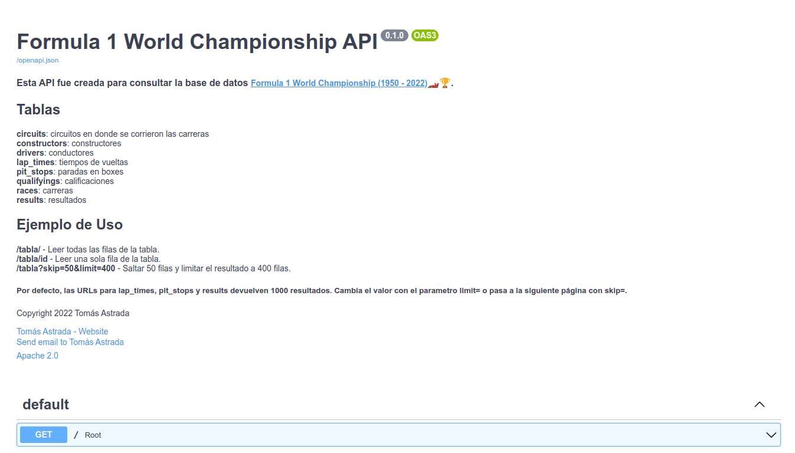

<!-- Improved compatibility of back to top link: See: https://github.com/othneildrew/Best-README-Template/pull/73 -->
<a name="readme-top"></a>
<!--
*** Thanks for checking out the Best-README-Template. If you have a suggestion
*** that would make this better, please fork the repo and create a pull request
*** or simply open an issue with the tag "enhancement".
*** Don't forget to give the project a star!
*** Thanks again! Now go create something AMAZING! :D
-->


<!-- PROJECT SHIELDS -->
<!--
*** I'm using markdown "reference style" links for readability.
*** Reference links are enclosed in brackets [ ] instead of parentheses ( ).
*** See the bottom of this document for the declaration of the reference variables
*** for contributors-url, forks-url, etc. This is an optional, concise syntax you may use.
*** https://www.markdownguide.org/basic-syntax/#reference-style-links
-->


<!-- PROJECT LOGO -->
<br />
<div align="center">
  <a href="https://github.com/AstradaT">
    
  </a>

  <h3 align="center">Formula 1 World Championship API</h3>
</div>


<!-- ABOUT THE PROJECT -->
## Sobre Este Proyecto

<div align="center">
    
</div>
<br>

### Esta API fue creada para consultar la base de datos [Formula 1 World Championship (1950 - 2022)](https://www.kaggle.com/datasets/rohanrao/formula-1-world-championship-1950-2020)🏎🏆.

### Tablas
**circuits**: circuitos en donde se corrieron las carreras<br>
**constructors**: constructores<br>
**drivers**: conductores<br>
**lap_times**: tiempos de vueltas<br>
**pit_stops**: paradas en boxes<br>
**qualifyings**: calificaciones<br>
**races**: carreras<br>
**results**: resultados<br>


### Hecho Con

* [FastAPI](https://fastapi.tiangolo.com/)
* [SQLite](https://www.sqlite.org/index.html)


<!-- GETTING STARTED -->
### Instalación

1. Clonar el repositorio
    ```sh
    git clone https://github.com/AstradaT/PI01_DATA03.git
    ```
2. Instalar librerías necesarias
    ```sh
    pip install -r requirements.txt
    ```
3. Correr servidor de manera local (Ctrl+C para detener)
   ```sh
   uvicorn main:app
   ```


<!-- USAGE EXAMPLES -->
### Ejemplo de Uso

**/tabla/** - Leer todas las filas de la tabla.<br>
**/tabla/id** - Leer una sola fila de la tabla.<br>
**/tabla?skip=50&limit=400** - Saltar 50 filas y limitar el resultado a 400 filas.

#### Por defecto, las URLs para **lap_times**, **pit_stops** y **results** devuelven 1000 resultados. Cambia el valor con el parametro **limit=** o pasa a la siguiente página con **skip=**.


<!-- CONTACT -->
### Contact

Tomás Astrada - [Linkedin](https://www.linkedin.com/in/tom%C3%A1s-astrada-370b73171/)<br>
Email - tomasastrada907@gmail.com


<!-- ACKNOWLEDGMENTS -->
### Reconocimientos

* [FastAPI CRUD Router](https://fastapi-crudrouter.awtkns.com/)


<!-- LICENSE -->
### Licencia

Licensed under the Apache License, Version 2.0. See `LICENSE.txt` for more information.

